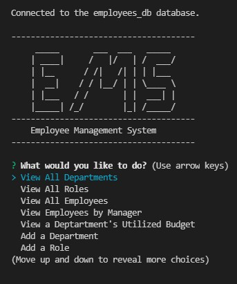

# Employee-Management-System

## Description

A command line application to help manage a company's employee database. The application allows the user to view: Departments, Roles, Employee data, all the employees that report to a given manager, and a department's total utilized budget. It also allows the user to add new departments, roles, and employees as well as update an employee's role or manager.

## Table of Contents

- [Installation](#installation)
- [Usage](#usage)
- [Contributing](#contributing)
- [Tests](#tests)
- [Questions](#questions)

## Installation

1. Clone the repository
2. Open a terminal at the root folder
3. Type `npm i`
4. Open a mysql shell at the root folder
5. Type `source db/schema.sql;` then `source db/seeds.sql;` then `quit;`

## Usage

[Demonstration Video](https://drive.google.com/file/d/1SnPjHrLkBnNkWfSVr36kgNF94oEn0KgC/view)

Type `npm start` in the terminal then follow the prompts

Intro Menu:

## Contributing

Fork a copy, make your enhancements, make a pull request and contact me via the contact information in the [Questions](#questions) section.

## Tests

There are currently no unit tests for this application

## Questions

For any additional questions please reach out to me at:

[My Github Profile](https://github.com/AdrianCronin)

[Email](mailto:acronindev@gmail.com)

